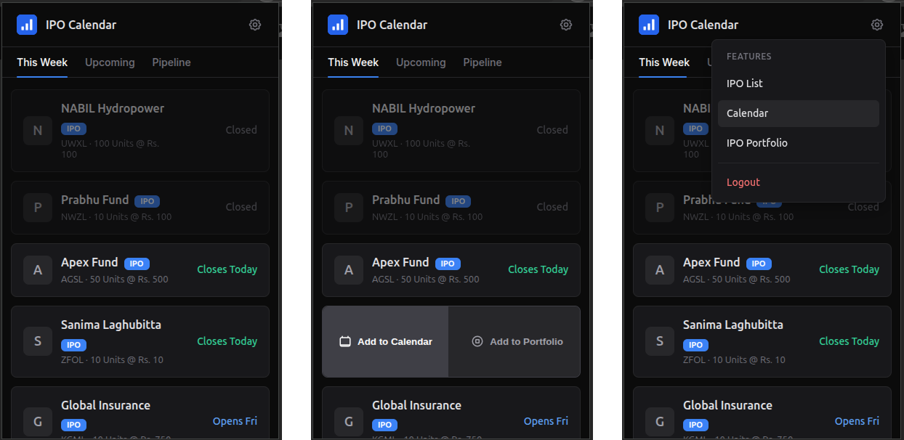
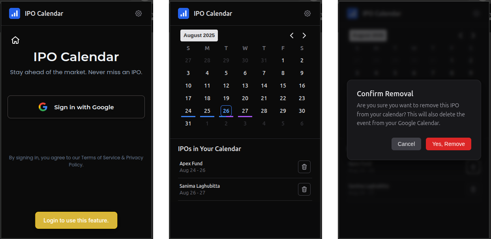
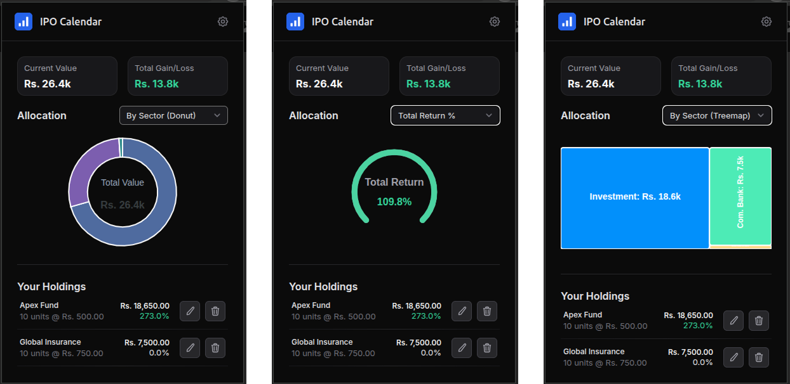

# IPO Calendar - Chrome Extension




<p align="center">
  A modern Chrome Extension to track upcoming Initial Public Offerings (IPOs) and seamlessly add them to your Google Calendar.
</p>

---

## Features

*   **Upcoming IPO Dashboard:** A clean, tabbed interface to view upcoming IPOs for the current week, the near future, and the long-term pipeline.
*   **Rich Data Display:** Each IPO card shows key information like IPO type (IPO, FPO), ticker, units, price, and subscription status.
*   **Interactive UI:** Polished animations, hover effects, and a professional dark theme for a premium user experience.
*   **Google OAuth 2.0 Integration:** Securely sign in with your Google account to unlock advanced features.
*   **One-Click "Add to Calendar":** Instantly add any IPO's schedule to your personal Google Calendar. *(Authentication required)*
*   **Personal Portfolio:** Track IPOs you've applied for, edit your holdings, and visualize your portfolio's performance with interactive charts. *(Authentication required)*

## Tech Stack

This extension is built with a modern, type-safe, and reactive frontend stack:

*   **Framework:** [Vue 3](https://vuejs.org/) (with Composition API and `<script setup>`)
*   **Build Tool:** [Vite](https://vitejs.dev/) via the `extension.js` toolkit
*   **Language:** [TypeScript](https://www.typescriptlang.org/)
*   **State Management:** [Pinia](https://pinia.vuejs.org/)
*   **Charting:** [ApexCharts](https://apexcharts.com/)
*   **Date Handling:** [Day.js](https://day.js.org/)

## Getting Started

To run this extension locally for development, you'll need [Node.js](https://nodejs.org/) (v18+) and the `npm` package manager installed.

### 1. The Backend Server

This frontend requires the corresponding **[IPO Calendar Laravel Backend](https://github.com/your-username/ipo-calendar-backend)** to be running. Please follow the setup instructions in that repository first. By default, the backend should be running on `http://localhost:8000`.

### 2. Frontend Setup

1.  **Clone the repository:**
    ```bash
    git clone https://github.com/your-username/ipo-calendar-extension.git
    cd ipo-calendar-extension
    ```

2.  **Install dependencies:**
    ```bash
    npm install
    ```

3.  **Run the development server:**
    This command will watch for file changes and rebuild the extension automatically.
    ```bash
    npm run start
    ```
    This will create a `dist/` directory containing the unpacked extension files.

### 3. Loading the Extension in Chrome

1.  Open Google Chrome and navigate to `chrome://extensions`.
2.  Enable **"Developer mode"** using the toggle in the top-right corner.
3.  Click the **"Load unpacked"** button.
4.  Select the `dist/chrome` folder that was generated inside your project directory.
5.  The "IPO Calendar" extension should now appear in your list of extensions and in your browser's toolbar!

## Project Structure

*   `public/`: Static assets that are copied directly to the build.
*   `src/`: All the main source code for the extension.
    *   `background/`: The service worker script.
    *   `components/`: Reusable Vue components (`IpoList`, `TheHeader`, `Login`, etc.).
    *   `options/`: The Vue app for the extension's options page.
    *   `popup/`: The main Vue app for the extension's popup.
    *   `stores/`: Pinia stores for state management (`auth`, `ipos`, `portfolio`, etc.).
*   `manifest.json`: The core configuration file for the Chrome Extension.

## Contributing

Contributions, issues, and feature requests are welcome! Feel free to check the [issues page](https://github.com/your-username/ipo-calendar-extension/issues).

## License

This project is licensed under the MIT License.